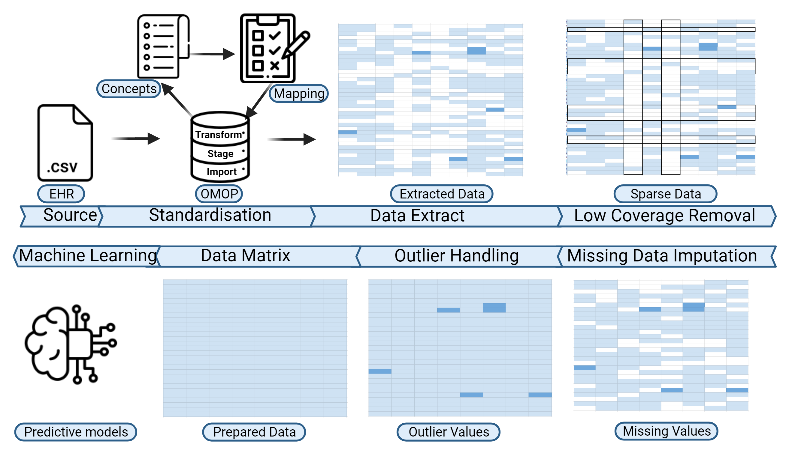

2023 AI.Care
============

This tutorial contains the commands for standardising and pre-processing electronic health record (EHR) data using EHR-QC.

Pipeline Diagram
----------------

01. Environment set-up for Standardisation
-----------------------------------------

.. code-block:: console

   deactivate
   cd ../EHR-QC-Standardise/
   source .venv/bin/activate

02. Import Standard Vocabulary
-----------------------------

.. code-block:: console

   python -m ehrqc.standardise.Run -l

03. Import EHR
-------------

.. code-block:: console

   python -m ehrqc.standardise.Run -f

04. Stage EHR
------------

.. code-block:: console

   python -m ehrqc.standardise.Run -s

05. Perform Concept Mapping
--------------------------

.. code-block:: console

   python -m ehrqc.standardise.MapConcepts "Measurement" "SNOMED" "Observable Entity" "$EHR_QC_DEMO_BASE/2023_11_aicare/data/concepts/concepts_raw.csv" "CONCEPT" "$EHR_QC_DEMO_BASE/2023_11_aicare/data/concepts/concepts_to_review.csv" --model_pack_path="$EHR_QC_DEMO_BASE/2023_11_aicare/data/medcat/mc_modelpack_snomed_int_16_mar_2022_25be3857ba34bdd5.zip"

06. Import Mapped Concepts
-------------------------

.. code-block:: console

   python -m ehrqc.standardise.Run -c

07. Perform ETL
--------------

.. code-block:: console

   python -m ehrqc.standardise.Run -e

08. Environment set-up for Preprocessing
---------------------------------------

.. code-block:: console

   deactivatedeactivate
   cd ../EHR-QC-Preprocess/
   source .venv/bin/activate

09. Coverage Analysis
--------------------

.. code-block:: console

   psql -h localhost -p 5434 -U postgres -d mimic4 -c "select con.concept_name, con.concept_code, (count(distinct mmt.person_id)::float * 100)/989 as person_level_coverage, (count(distinct mmt.visit_occurrence_id)::float * 100)/1000 as episode_level_coverage from eicu_etl_20231121.cdm_measurement mmt inner join eicu_etl_20231121.concept con on con.concept_code = mmt.measurement_concept_id where mmt.unit_id = 'labevents' group by con.concept_name, con.concept_code order by person_level_coverage desc;"

10. Extract data
---------------

.. code-block:: console

   python -m ehrqc.extract.ExtractData $EHR_QC_DEMO_BASE/2023_11_aicare/data/raw/labs_avg_episode_date.csv eicu_etl_20231121 $EHR_QC_DEMO_BASE/2023_11_aicare/data/sql/extract/avg.sql

11. Coverage Analysis
--------------------

.. code-block:: console

   python -m ehrqc.coverage.Coverage $EHR_QC_DEMO_BASE/2023_11_aicare/data/raw/labs_avg_episode_date.csv 100000 -i "person_id" "visit_occurrence_id"  -d -p 20 -sp $EHR_QC_DEMO_BASE/2023_11_aicare/data/dropped/labs_avg_episode_date.csv

12. Impute Missing Data
----------------------

.. code-block:: console

   python -m ehrqc.impute.Impute -ac 'impute' $EHR_QC_DEMO_BASE/2023_11_aicare/data/dropped/labs_avg_episode_date.csv -sp $EHR_QC_DEMO_BASE/2023_11_aicare/data/imputed/labs_avg_episode_date.csv -al miss_forest -c 'Sodium level' 'Blood urea nitrogen' 'Creatinine level' 'Potassium level' 'Chloride' 'Hematocrit' 'Haemoglobin estimation' 'Platelet count' 'Red blood cell count' 'Calcium level' 'MCV - Mean corpuscular volume' 'MCHC - Mean corpuscular haemoglobin concentration' 'Albumin' 'MCH - Mean corpuscular haemoglobin' 'Serum alkaline phosphatase level' 'Aspartate aminotransferase measurement' 'Alanine aminotransferase' 'Total bilirubin level' 'White blood cell count' 'Red blood cell distribution width' 'Total protein measurement' 'Glucose level' 'Bicarbonate level' 'Anion gap' 'Lymph' 'Infectious mononucleosis test'

13. Outlier Analysis
-------------------

.. code-block:: console

   python -m ehrqc.plot.OutlierIsolationForest $EHR_QC_DEMO_BASE/2023_11_aicare/data/imputed/labs_avg_episode_date.csv $EHR_QC_DEMO_BASE/2023_11_aicare/data/cleaned/labs_avg_episode_date.csv clean -c 'Sodium level' 'Blood urea nitrogen' 'Creatinine level' 'Potassium level' 'Chloride' 'Hematocrit' 'Haemoglobin estimation' 'Platelet count' 'Red blood cell count' 'Calcium level' 'MCV - Mean corpuscular volume' 'MCHC - Mean corpuscular haemoglobin concentration' 'Albumin' 'MCH - Mean corpuscular haemoglobin' 'Serum alkaline phosphatase level' 'Aspartate aminotransferase measurement' 'Alanine aminotransferase' 'Total bilirubin level' 'White blood cell count' 'Red blood cell distribution width' 'Total protein measurement' 'Glucose level' 'Bicarbonate level' 'Anion gap' 'Lymph' 'Infectious mononucleosis test'

14. Pre-processing Report
------------------------

.. code-block:: console

   python -m ehrqc.plot.ExplorationGraphsPdf $EHR_QC_DEMO_BASE/2023_11_aicare/data/plots/combined/labs_avg_episode_date.pdf -c '{"Sodium level" : ["Sodium level", "Sodium level", "Sodium level"], "Blood urea nitrogen" : ["Blood urea nitrogen", "Blood urea nitrogen", "Blood urea nitrogen"], "Creatinine level" : ["Creatinine level", "Creatinine level", "Creatinine level"], "Potassium level" : ["Potassium level", "Potassium level", "Potassium level"], "Chloride" : ["Chloride", "Chloride", "Chloride"], "Hematocrit" : ["Hematocrit", "Hematocrit", "Hematocrit"], "Haemoglobin estimation" : ["Haemoglobin estimation", "Haemoglobin estimation", "Haemoglobin estimation"], "Platelet count" : ["Platelet count", "Platelet count", "Platelet count"], "Red blood cell count" : ["Red blood cell count", "Red blood cell count", "Red blood cell count"], "Calcium level" : ["Calcium level", "Calcium level", "Calcium level"], "MCV - Mean corpuscular volume" : ["MCV - Mean corpuscular volume", "MCV - Mean corpuscular volume", "MCV - Mean corpuscular volume"], "MCHC - Mean corpuscular haemoglobin concentration" : ["MCHC - Mean corpuscular haemoglobin concentration", "MCHC - Mean corpuscular haemoglobin concentration", "MCHC - Mean corpuscular haemoglobin concentration"], "Albumin" : ["Albumin", "Albumin", "Albumin"], "MCH - Mean corpuscular haemoglobin" : ["MCH - Mean corpuscular haemoglobin", "MCH - Mean corpuscular haemoglobin", "MCH - Mean corpuscular haemoglobin"], "Serum alkaline phosphatase level" : ["Serum alkaline phosphatase level", "Serum alkaline phosphatase level", "Serum alkaline phosphatase level"], "Aspartate aminotransferase measurement" : ["Aspartate aminotransferase measurement", "Aspartate aminotransferase measurement", "Aspartate aminotransferase measurement"], "Alanine aminotransferase" : ["Alanine aminotransferase", "Alanine aminotransferase", "Alanine aminotransferase"], "Total bilirubin level" : ["Total bilirubin level", "Total bilirubin level", "Total bilirubin level"], "White blood cell count" : ["White blood cell count", "White blood cell count", "White blood cell count"], "Red blood cell distribution width" : ["Red blood cell distribution width", "Red blood cell distribution width", "Red blood cell distribution width"], "Total protein measurement" : ["Total protein measurement", "Total protein measurement", "Total protein measurement"], "Glucose level" : ["Glucose level", "Glucose level", "Glucose level"], "Bicarbonate level" : ["Bicarbonate level", "Bicarbonate level", "Bicarbonate level"], "Anion gap" : ["Anion gap", "Anion gap", "Anion gap"], "Lymph" : ["Lymph", "Lymph", "Lymph"], "Infectious mononucleosis test" : ["Infectious mononucleosis test", "Infectious mononucleosis test", "Infectious mononucleosis test"]}' -sf $EHR_QC_DEMO_BASE/2023_11_aicare/data/dropped/labs_avg_episode_date.csv $EHR_QC_DEMO_BASE/2023_11_aicare/data/imputed/labs_avg_episode_date.csv $EHR_QC_DEMO_BASE/2023_11_aicare/data/cleaned/labs_avg_episode_date.csv -l "Raw" "Imputed" "Cleaned"
